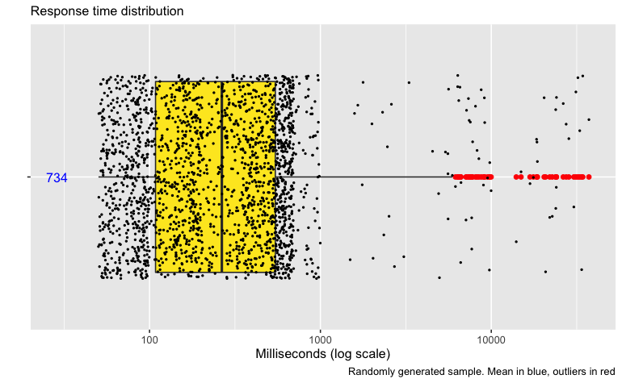
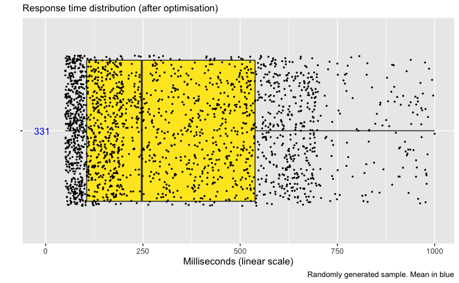
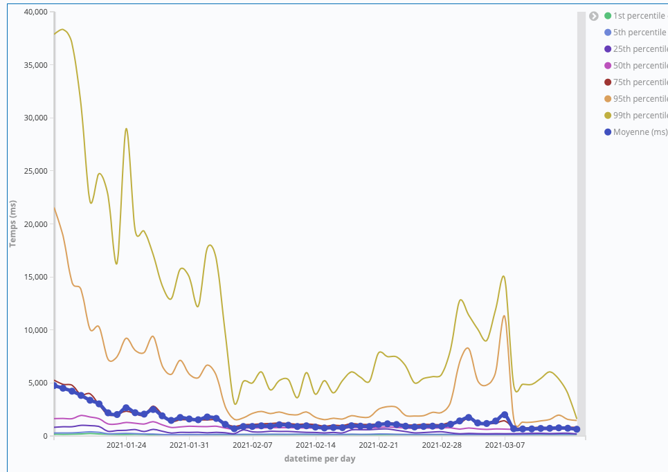

Performance optimization usually focuses on the "hot path": code that gets executed the most often.  
I will argue that it's sometimes worth focusing on code that is executed the __least__ often.

Let's agree on a few assumptions first:

* we are trying to optimize for low response time
* ressources (developper time and infrastructure budget) are limited
* time spent on optimization has diminishing returns
* high response time has a non-linear negative impact on outcomes you care about : overall system health, customer perception, etc.

What I mean by "non-linear" is that it's worse to have one 20 seconds request than ten 2 seconds requests

If you disagree with these premices or they don't apply to you, then this article probably won't be useful to you.

## Collect data

1. Bound the scope of what you *can* optimize (for example, if you don't have control over network speed, let it out of the scope)
2. Log response times within that scope
3. Log any additional information about the requests you may need later (endpoints, parameters, etc.)

In the following examples, I will not be using real data but a sample generated from an arbitrary probability distribution. [The R notebook that I used to generate the sample and plot graphs can be downloaded here](r-notebook/response-distribution.Rmd).  

## Look for fat tails

The mean response time is a good target to optimize because it is a decent proxy for the average experience of our users, but it also hides information.
We need to look at the mean **and the distribution**.  

We are looking for a distribution that looks like this:

> Perplexed? [How to read a boxplot](https://www.data-to-viz.com/caveat/boxplot.html)

My sample, which is a bit extreme to emphasize my point, has the following probability distribution:

| time (ms) | probability |
|--|--|
|50 to 1000 | 97% |
|1001 to 10000 | 2% | 
|10001 to 40000 | 1% | 

**A "fat tail" situation: there is a relatively low, yet significant probability of having an extremely bad outcome**.

Just looking at the mean (734 in this case), it can be difficult to see that some users are getting response times orders of magnitude higher.

## Start optimizing

To get the mean down, we have 2 options:

* Improve the "hot path" to affect 100% of requests. This is good, but you probably spend a good amount of time on that already, and there are no more easy wins.
* Focus on the worst outliers (99th percentile). Hopefully there will be more low-hanging fruits there.

Suggested heuristic:

* No fat tail? Maybe focusing on the hot path is the way to go.
* If you do spot a fat tail : maybe focus on the outliers first, the hot path later.

With some luck, your plot will soon look like this (notice the change of scale):

## Tracking response time distribution over time

Other types of charts can help you track distribution over time.  
E.g. in Kibana, you can build a line chart with percentiles on top of a logstash index to see your optimization efforts pay off (this is a real example, by the way):

The yellow line (highest on the chart) tracks the 99th percentile, the purple dotted line shows the mean.

